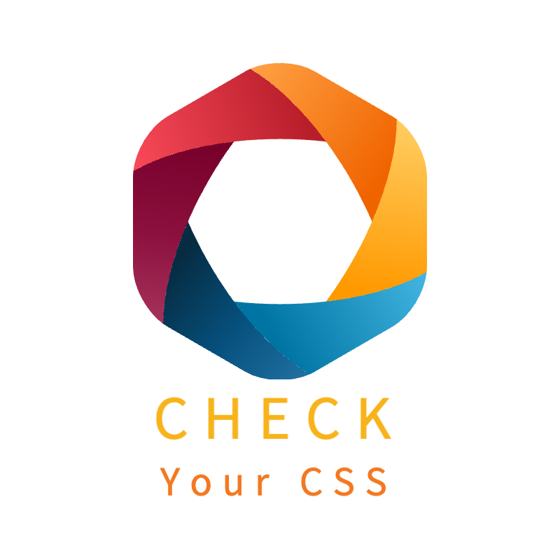

# Check Your CSS

<p align="center">

</p>

<p align="center">
사용자의 프로젝트에서 모든 CSS를 가져와 호환성을 체크하는 도구입니다.
</p>

# 🔗 Links

<p align="center">
  <a href="#">Deployed website</a>
  <span> | </span>
  <a href="https://github.com/TeamTitans1/checkyourcss-npm">npm Repository</a>
  <span> | </span>
  <a href="https://github.com/TeamTitans1/checkyourcss-vscode">VS code Extension Repository</a>
</p>

# 📌 Table of Contents

# 🛠 Tech Stacks


# 📌 Introduction

## ❓ Why CSS Compatibility?

- CSS 호환성이란 CSS 스타일이 다양한 웹 브라우저에서 일관되게 동작하고 올바르게 표시되는 능력을 의미합니다. 이는 웹 개발에서 다음과 같은 이유로 중요합니다:

  1. 각 브라우저는 웹 표준을 조금씩 다르게 해석하고 구현할 수 있습니다. 예를 들어, 최신 CSS 속성이나 기능이 특정 브라우저에서는 지원되지만 다른 브라우저에서는 지원되지 않을 수 있습니다. 이런 차이는 웹 페이지가 브라우저마다 다르게 보이거나 작동하게 만들 수 있습니다.
  2. 사용자는 다양한 장치를 통해 웹에 접근합니다. 각 장치는 화면 크기, 해상도, 사용자 인터페이스 등이 다르므로 모든 환경에서 일관된 사용자 경험을 제공하려면 CSS가 이러한 다양성을 지원해야 합니다.
  3. 브라우저는 정기적으로 업데이트되면, 새로운 버전마다 CSS에 대한 지원이 변경될 수 있습니다. 이러한 변화에 대응하여 웹 사이트나 애플리케이션이 최신 브라우저에서도 잘 동작하도록 보장해야 합니다.

- CSS 호환성을 확보하기 위해 개발자는 다양한 사용자 환경에서도 웹 페이지의 기능성과 시각적 일관성을 유지할 수 있어야 합니다. CSS 호환성은 사용자가 어떤 환경에서 접근하든 일관된 경험을 제공함으로써 웹의 접근성과 사용성을 향상시키는 핵심 요소입니다. 따라서 CSS 호환성에 대한 프로젝트를 진행하였습니다.

## ⚙️ Three Different Platforms

- 다양한 사용자, 그리고 개발자가 보다 쉽게 사용할 수 있도록 3가지 플랫폼으로 만들었습니다.

1. Electron을 이용한 데스크탑 앱

- Electron 앱은 Windows, MacOS, Linux 등 다양한 운영체제에서 실행할 수 있습니다. 따라서 다양한 운영체제를 가진 장치에서 사용 가능하도록 만들었습니다. 또한, 직관적인 인터페이스를 제공하여 누구나 쉽게 프로젝트를 사용할 수 있도록 하였습니다.

2. VS Code Extension

- 현재 가장 많이 사용하는 텍스트 에디터인 VS Code Extension을 통해 실시간으로 호환성 정보를 제공하여 개발 효율성을 높이고자 하였습니다. 또한, 직관적으로 정보를 파악할 수 있도록 호환되지 않는 CSS를 표시해주어 사용자가 쉽게 사용할 수 있도록 하였습니다.

3. npm package

- 범용성이 높은 npm package는 누구나 쉽게 접근하고, 개발자가 자신의 프로젝트에 설치하여 손쉽게 사용할 수 있도록 하였습니다. 또한 재사용성과 공유가 쉬워 개발 속도를 높이고자 하였습니다.

<br />

# 📌 Challenges

## 🔥 Utility-first CSS에서 사용된 CSS만 가져오기

- Utility-first CSS는 정해진 클래스를 HTML에 직접 적용하여 스타일을 지정하는 CSS 프레임워크입니다. 대표적인 예로는 TailwindCSS가 있습니다.
- Utility-first CSS에서 CSS 속성을 가져오기 위해 처음에는 직접 JSX 요소를 찾아 클래스를 찾았습니다. 그리고 그렇게 찾은 CSS class를 [Tailwind to CSS](https://github.com/Devzstudio/tailwind_to_css/) 웹 사이트를 참고하여 변경시켰습니다. 하지만 이렇게 진행하다 보니 데이터에 대한 한계, 그리고 많은 엣지 케이스들이 나오게 되어 다른 방법을 강구하게 되었습니다.
- TailwindCSS를 사용한 프로젝트를 빌드하게 되면 하나의 CSS 파일이 빌드된 폴더에서 생성된다는 것을 확인할 수 있었습니다. 그리고 그 파일에는 TailwindCSS class를 class명으로된 CSS 속성을 가지고 있었습니다.

```css
/* 빌드 폴더에 있는 CSS 파일 예시 */
.text-center {
  text-align: center;
}

.text-4xl {
  font-size: 2.25rem;
  line-height: 2.5rem;
}
```

- 프로젝트를 빌드시키기 위해서는 Node.js 내장 모듈인 `os` 모듈의 `tmpdirectory()` 메서드를 사용하였습니다. 이 메서드는 개발자가 운영체제에 관계없이 임시 디렉토리의 경로를 쉽게 얻을 수 있게 해줍니다. 임시 디렉토리에 저장된 파일은 운영체제나 애플리케이션에 따라 정기적으로 삭제될 수 있습니다. 따라서 사용자 프로젝트에 영향없이 임시 디렉토리에 빌드시키고, 생성된 파일을 이용하여 CSS 속성을 가져오게 되었습니다.

## 🔥 빌드된 Utility-first-CSS와 Styled-components에서 CSS속성만 가져오기

### ❓ AST란

- AST _(Abstract Syntax Tree, 추상 구문 트리)_ 는 소스 코드의 구조를 나무 형태로 표현한 것으로, 코드의 구문적 구조를 분석할 때 사용되며 프로그래밍 언어의 구문을 분석하고 처리하는 데에 널리 사용됩니다.

- AST로 파싱되는 과정

1. 어휘 분석(Lexical Analysis)

**어휘 분석**의 목적은 소스 코드를 읽고, 이를 토큰(Token)이라는 의미 있는 단위로 분해하는 것입니다. 여기서 토큰이란 변수 이름, 연산자, 숫자, 괄호 등 코드의 기본 요소를 나타냅니다.

어휘 분석을 하며 소스코드를 읽을 때 코드를 문자 단위 하나하나 스캔하며 공백, 연산자 기호 또는 특수 기호를 발견하면 단어가 완성되었다고 판별하게 됩니다. 단어가 완성되었다고 판별되면 단어를 분석하고 분석한 단어가 변수명인지, 연산자인지, 숫자 리터럴 등등으로 판별하고 토큰의 타입을 결정합니다.

2. 구문 분석(Syntactic Analysis)

구문 분석의 목적은 어휘 분석을 통해 얻은 토큰들 분석하여, 이들의 관계를 이해하고 AST를 생성하는 것입니다. 이 단계에서는 코드의 구조적 의미를 파악하고, 토큰들 사이의 문법적 관계를 파악하여, 프로그램의 구조적 의미를 나타내는 트리를 만듭니다.

- ex) const sum = 5 + 3;

먼저 어휘분석을 하게 되어 코드들을 토큰으로 나누게 됩니다. 이 예시의 경우에선 const, sum, =, 1, + ,2, ;이 토큰이 됩니다.

다음으로 구문분석을 하게 되면 위에서 생성된 토큰들을 기반으로 AST를 생성하게 됩니다.

가장 최상위 노드는 변수를 선언하는 const이며 아래로 sum이라는 변수가 있고 그 아래로 연산자를 의미하는 + 와 왼쪽에는 5, 오른쪽에는 3이 있다는 이러한 구조의 AST가 생성되게 됩니다.

이러한 방식과 마찬가지로 css파일이나 styled-component가 사용된 파일에서 코드를 파싱해서 생성된 AST를 순회하여 구조를 분석하고 단어의 의미를 파악하여 CSS속성을 찾는 방식으로 프로젝트를 진행하였습니다.
