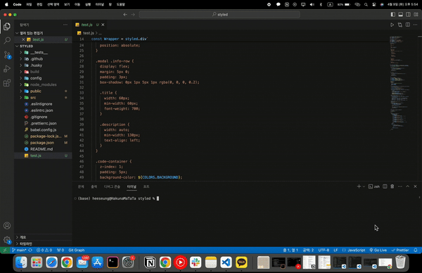
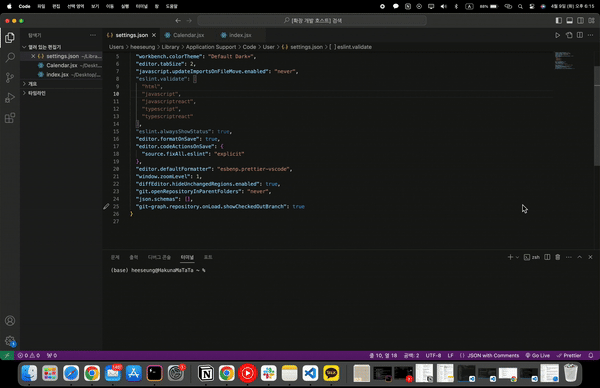

# Check Your CSS

<p align="center">

</p>

<p align="center">
사용자의 프로젝트에서 모든 CSS를 가져와 호환성을 체크하는 도구입니다.
</p>

# 🔗 링크

<p align="center">
  <a href="#">Deployed website</a>
  <span> | </span>
  <a href="https://github.com/TeamTitans1/checkyourcss-npm">npm Repository</a>
  <span> | </span>
  <a href="https://github.com/TeamTitans1/checkyourcss-vscode">VS code Extension Repository</a>
</p>

# 📌 목차

- [🎬 시연](#-시연)
- [🛠 기술 스택](#-기술-스택)
- [💡 동기](#-동기)
  - [❓ CSS 호환성이 왜 중요한가?]()
- [🔥 도전]()
  - [1. TailwindCSS에서 사용된 CSS 가져오기]()
    - [1-1. 문제점: 사용자 지정 CSS를 가져올 수 없다.]()
    - [1-2. 해결책: 빌드를 이용하자.]()
    - [1-3. 구현: `tmpdirectory()`를 이용한 임시 파일 저장 공간 생성]()
    - [1-4. 결과: 정확성 높은 CSS 추출]()
  - [2. TailwindCSS와 styled-components 파일에서 CSS 속성 추출하기]()
    - [2-1. 문제점: CSS의 의사 클래스를 가져올 수 없다.]()
    - [2-2. 해결책: AST를 이용하자.]()
    - [2-3. 구현: Babel `parser`를 사용한 AST 구현]()
    - [2-4. 결과: 정확도 높은 CSS 속성 추출]()
  - [3. 다양한 플랫폼으로 구현하기]()
    - [3-1. 문제점: 개발자가 사용할까?]()
    - [3-2. 해결책: 다른 플랫폼으로도 만들어보자.]()
    - [3-3. 구현: npm 패키지와 VSCode 익스텐션 구현]()
    - [3-4. 결과: 사용자에게 다양한 플랫폼을 제공]()

# 🎬 시연

<details>
<summary>npm 패키지 시연</summary>
  
</details>

<details>
<summary>VSCode 익스텐션 시연</summary>
  
</details>

# 🛠 기술 스택


# 💡 동기

- 웹페이지를 만들면서 `reset-CSS`를 사용하는 것을 궁금해왔습니다. 각각의 브라우저가 가지는 기본적인 CSS 설정이 다르기 때문에 크로스 브라우징 호환성을 고려하기 때문에 사용한다는 것을 알게 되었습니다. 그렇게 크로스 브라우징 호환성을 공부하던 중에 [caniuse.com](https://caniuse.com/) 웹사이트를 알게 되었습니다. 이 웹사이트는 다양한 브라우저가 검색한 CSS의 호환성을 알려주는 사이트였습니다. 이를 계기로 개발자가 만든 프로젝트 전체를 편리하게 CSS 호환성을 알려주는 도구가 있으면 좋겠다고 생각하여 본 프로젝트를 기획하게 되었습니다.

## ❓ CSS 호환성이 왜 중요한가?

- CSS 호환성은 웹 개발의 필수 요소로, 모든 사용자에게 일관된 경험을 제공하는 데 핵심적인 역할을 합니다. 이는 웹 페이지가 다양한 브라우저와 장치에서도 예상대로 작동하고 표시되게 하는 것을 목표로 합니다. 이해의 편의를 위해, 왜 CSS 호환성이 중요한지 그리고 이에 대한 심층적인 이해를 돕기 위해 몇 가지 주요 포인트를 자세히 살펴보겠습니다.

### 🌐 다양한 웹 브라우저에서의 일관성

- 웹 개발자로서 가장 큰 도전 중 하나는 다양한 웹 브라우저에서 일관된 사용자 경험을 제공하는 것입니다. 각 브라우저는 자체적인 렌더링 엔진을 가지고 있으며, 이는 동일한 CSS 코드가 브라우저마다 다르게 해석될 수 있음을 의미합니다. 예를 들어, Firefox에서 잘 작동하는 CSS 스타일이 Internet Explorer에서는 원하는 대로 표시되지 않을 수 있습니다. 이는 브라우저마다 다른 CSS 속성과 기능의 구현 및 지원 수준 때문입니다. 따라서, 개발자는 크로스 브라우징 호환성을 고려하여 모든 사용자에게 안정적인 경험을 제공해야 합니다.

### 📱 다양한 장치와 화면 크기에 대한 대응

- 현대의 웹 사용자는 다양한 장치를 사용하여 웹에 접근합니다. 스마트폰, 태블릿, 데스크톱, 심지어 스마트워치와 같은 다양한 장치에서 웹 사이트가 잘 작동해야 합니다. 이는 개발자가 다양한 화면 크기, 해상도, 입력 방식 등을 고려해야 함을 의미합니다. 반응형 웹 디자인은 이러한 다양성을 지원하기 위해 필수적이며, CSS는 이 과정에서 중심적인 역할을 합니다.

### 🔄 브라우저의 지속적인 업데이트

- 브라우저는 지속적으로 업데이트되며, 각 업데이트는 새로운 기능이 추가되거나 기존 기능이 변경될 수 있습니다. 이러한 변화는 웹 개발자에게 지속적인 학습과 적응을 요구합니다. 또한, 웹 사이트나 애플리케이션이 최신 표준을 따르면서도 가능한 한 많은 브라우저와 장치에서 작동할 수 있도록 유지보수하는 것이 중요합니다.

### 🚀 프로젝트의 중요성

- 이러한 이유로, CSS 호환성에 중점을 둔 프로젝트를 진행하는 것은 매우 중요합니다. 이 프로젝트의 목적은 웹 개발자들이 다양한 브라우저와 장치에서 일관된 경험을 제공할 수 있도록 지원하는 것입니다. 이를 통해 개발자는 CSS 코드가 예상대로 작동하고, 사용자에게 최적화된 경험을 제공할 수 있는지 검증할 수 있습니다. 결과적으로, 이 프로젝트는 웹의 접근성과 사용성을 향상시키는 데 기여하며, 더 넓은 사용자 베이스에 웹 콘텐츠를 제공할 수 있는 기회를 열어줍니다.

- CSS 호환성은 단순히 기술적인 문제를 넘어서 사용자 경험과 직결되는 요소입니다. 모든 사용자가 어떤 환경에서든 최상의 경험을 할 수 있도록 보장하는 것은 웹 개발의 핵심 철학 중 하나이며, 이는 웹을 더 포괄적이고 접근 가능한 공간으로 만드는 데 기여합니다.

# 🔥 도전

## 1. TailwindCSS에서 사용된 CSS 가져오기

- Utility-first CSS, 특히 TailwindCSS 같은 프레임워크의 적용은 웹 개발의 효율성과 유지보수성을 대폭 향상시킵니다. 이러한 접근 방식은 디자인과 개발의 간격을 좁히고, 빠르고 일관된 스타일링을 가능하게 합니다. 그러나 이 방식을 적용하며 직면한 도전 중 하나는 프로젝트에서 실제로 사용된 CSS를 추출하는 것입니다.

### 1-1. 문제점: 사용자 지정 CSS를 가져올 수 없다.

- Utility-first CSS는 반복적인 stylesheet 대신, HTML에 클래스를 직접 적용하여 스타일을 지정합니다. TailwindCSS와 같은 프레임워크는 수많은 유틸리티 클래스를 제공하여, 개발자가 복잡한 CSS 파일을 작성하지 않고도 다양한 디자인을 구현할 수 있게 합니다. 이는 개발 속도를 높이고, 디자인의 일관성을 유지할 수 있도록 돕습니다.
- 초기에 JSX 요소를 직접 탐색하여 클래스를 추출하고, 이를 [Tailwind to CSS](https://github.com/Devzstudio/tailwind_to_css/)와 같은 웹사이트를 통해 표준 CSS 속성으로 변환하는 방법을 사용했습니다. 이 접근법은 직관적이고 직접적이지만, 프로젝트의 규모가 커짐에 따라 다루어야 하는 데이터의 양이 증가하고, 예외 상황이나 복잡한 케이스를 처리하는 데 있어 한계를 드러냈습니다. 특히 사용자가 지정한 CSS는 가져올 수 없다는 것을 깨닫게 되었습니다. 그 이유는 참고한 웹사이트에서 해당 TailwindCSS에 대한 클래스를 찾을 수 없었기 때문입니다.

### 1-2. 해결책: 빌드를 이용하자.

- TailwindCSS를 사용한 프로젝트를 빌드할 때, 사용된 모든 Tailwind 클래스가 포함된 하나의 최종 CSS 파일이 생성된다는 점에 주목했습니다. 이 파일은 프로젝트에 실제로 사용된 모든 스타일 정보를 담고 있으므로, 사용자 지정 CSS 또한 가져올 수 있었습니다.

  ```css
  /* 빌드 폴더에 있는 CSS 파일 예시 */
  .text-center {
    text-align: center;
  }

  .text-4xl {
    font-size: 2.25rem;
    line-height: 2.5rem;
  }
  ```

### 1-3. 구현: `tmpdirectory()`를 이용한 임시 파일 저장 공간 생성

- Node.js의 `os` 모듈에서 제공하는 `tmpdirectory()` 메서드를 사용하여 임시 디렉토리의 경로를 얻습니다. 이 임시 디렉토리는 운영체제에 상관없이 접근 가능하며, 주기적으로 삭제되므로 사용자의 주요 프로젝트 파일에 영향을 주지 않습니다. 프로젝트를 이 임시 디렉토리에서 빌드하면, TailwindCSS 프레임워크는 사용된 모든 클래스를 포함하는 CSS 파일을 생성합니다. 이렇게 생성된 CSS 파일을 분석함으로써, 실제로 사용된 스타일만을 추출하고, 불필요한 코드를 제거하여 최적화할 수 있습니다.

### 1-4. 결과: 정확성 높은 CSS 추출

- 기존의 하드 코딩을 통해 CSS를 추출하는 방법이 아닌, 빌드해서 생성된 CSS 파일을 이용하여 정확성이 높은 CSS를 추출할 수 있었습니다.

## 2. TailwindCSS와 styled-components 파일에서 CSS 속성 추출하기

- 빌드한 Tailwind CSS와 styled-components 파일에서 CSS 속성을 추출하는 것은 본 프로젝트에서 중요한 일이었습니다. 프로젝트의 모든 CSS를 가져와 호환성을 확인해야 하는 과정을 거쳐야 했기 때문에 초기 단계 중 하나인 CSS 속성 추출은 정확도가 높아야 했습니다.

### 2-1. 문제점: CSS의 의사 클래스를 가져올 수 없다.

- 처음 하드 코딩으로 CSS 파일에서 속성을 가져올 때, 기본적인 CSS를 가져오는 데서는 문제가 발생하지 않았습니다. 하지만 복잡한 CSS, 그리고 기본적인 규칙을 벗어나는 CSS에 맞닥드렸을 때에는 문제점이 발생하였습니다. 초기에 문제가 발생하면 뒤에서 구현하는 기능 또한 문제가 되기 때문에 어떻게 해서든 문제를 해결해야 했습니다.

### 2-2. 해결책: AST를 이용하자.

- AST _(Abstract Syntax Tree, 추상 구문 트리)_ 는 소스 코드의 구조를 나무 형태로 표현한 것으로, 코드의 구문적 구조를 분석할 때 사용되며 프로그래밍 언어의 구문을 분석하고 처리하는 데에 널리 사용됩니다.
- AST가 파싱되는 과정은 두 가지로 나눌 수 있습니다:

  1. 어휘 분석(Lexical Analysis)

  - **어휘 분석**의 목적은 소스 코드를 읽고, 이를 토큰(Token)이라는 의미 있는 단위로 분해하는 것입니다. 여기서 토큰이란 변수 이름, 연산자, 숫자, 괄호 등 코드의 기본 요소를 나타냅니다.

  - 어휘 분석을 하며 소스코드를 읽을 때 코드를 문자 단위 하나하나 스캔하며 공백, 연산자 기호 또는 특수 기호를 발견하면 단어가 완성되었다고 판별하게 됩니다. 단어가 완성되었다고 판별되면 단어를 분석하고 분석한 단어가 변수명인지, 연산자인지, 숫자 리터럴 등등으로 판별하고 토큰의 타입을 결정합니다.

  2. 구문 분석(Syntactic Analysis)

  - 구문 분석의 목적은 어휘 분석을 통해 얻은 토큰들 분석하여, 이들의 관계를 이해하고 AST를 생성하는 것입니다. 이 단계에서는 코드의 구조적 의미를 파악하고, 토큰들 사이의 문법적 관계를 파악하여, 프로그램의 구조적 의미를 나타내는 트리를 만듭니다.

  - 예시
    - `const sum = 5 + 3;`를 예시를 들어 설명하면 먼저 어휘분석을 하게 되어 코드들을 토큰으로 나누게 됩니다. 이 예시의 경우에선 const, sum, =, 1, + ,2, ;이 토큰이 됩니다.
    - 다음으로 구문분석을 하게 되면 위에서 생성된 토큰들을 기반으로 AST를 생성하게 됩니다. 가장 최상위 노드는 변수를 선언하는 const이며 아래로 sum이라는 변수가 있고 그 아래로 연산자를 의미하는 + 와 왼쪽에는 5, 오른쪽에는 3이 있다는 이러한 구조의 AST가 생성되게 됩니다.

- 위에서 설명한 AST 방식을 통해 TailwindCSS와 styled-component가 사용된 파일에서 코드를 파싱하고 생성된 AST를 순회하여 구조를 분석하고 단어의 의미를 파악하여 CSS속성을 찾는 방식으로 프로젝트를 진행하였습니다.

### 2-3. 구현: Babel의 `traverse`와 `parser`를 이용하여 AST에서 CSS 속성 추출하기

- 오래된 브라우저에도 적용이 될 수 있도록 최신 문법을 오래된 문법으로 바꿔주는데 사용하는 Babel은 JavaScript의 컴파일러입니다. Babel은 대중적이기도 하면서 많이 사용되는 라이브러리 중 하나입니다. Babel이 구문 변환할 때 사용하는 `traverse`는 트리의 노드를 교체, 추가, 또는 제거하는 모듈입니다. 또한 `parser`는 Babel이 파싱하는 데 사용하는 모듈입니다. 우선 `traverse`를 사용하여 생성된 AST를 순회하면서 CSS 속성들을 찾고 `parser`를 이용하여 찾은 노드를 파싱하였습니다.

### 2-4. 결과: 정확도 높은 CSS 속성 추출하기

- AST를 이용하여 CSS 속성만을 파일에서 가져올 수 있으므로 보다 정확한 속성을 가져올 수 있었습니다.

## 3. 다양한 플랫폼으로 구현하기

- 처음에는 Electron을 이용한 데스크탑앱을 만들어 사용자에게 서비스를 제공하고자 하였습니다. Electron 기반의 데스크탑 앱은 플랫폼 간 호환성이 높습니다. Windows, MacOS, Linux 등 다양한 운영체제에서 실행되기 때문에, 사용자가 어떤 OS를 사용하든지 간에 동일한 사용자 경험을 제공할 수 있습니다. 이는 개발자에게도 큰 이점을 제공합니다. 단일 코드베이스를 유지하면서 여러 플랫폼에 앱을 배포할 수 있기 때문에, 개발 및 유지보수 과정이 효율적으로 이루어집니다. 또한, Electron 앱은 직관적인 사용자 인터페이스를 제공하여, 사용자가 추가적인 교육 없이도 앱을 쉽게 사용할 수 있도록 합니다. 이는 사용자의 만족도를 높이고, 앱의 접근성을 향상시키는 중요한 요소입니다.

### 3-1. 문제점: 개발자가 사용할까?

- 하지만 개발자가 데스크탑앱을 설치하고 프로젝트를 넣어 CSS 호환성을 확인할 것 같지 않았습니다. 그 이유는 방법이 너무 많은 과정을 거쳐야 했기 때문입니다. 우선 저 또한 데스크탑앱을 설치하여 사용할 것 같지 않았고, 이보다 더 편한 방법을 갈망했습니다.

### 3-2. 해결책: 다른 플랫폼으로도 만들어보자.

- 위 문제점을 해결하기 위해서 개발자들이 많이 사용하는 VSCode를 떠올렸습니다. VSCode 익스텐션을 이용하여 저장할 때마다 CSS 호환성을 확인하고 경고를 해준다면 개발자가 훨씬 편리하게 사용할 수 있다고 생각하였습니다. 또한, npm 패키지를 만들어 빌드하기 전에 확인할 수 있다면 좋다고 생각하였습니다.

### 3-3. 구현: npm 패키지와 VSCode 익스텐션 구현

- npm 패키지를 만들기 위해서는 Node.js를 이용하여 구현하였습니다. Electron을 이용한 방법과는 다른 기능을 생각하기도 하였습니다. 그 기능은 특정 명령어를 작성하면 파일의 코드를 변경시켜 주는 것이었습니다. 이를 구현하기 위해서는 CSS 호환성이 좋지 않은 속성의 위치를 객체에 저장한 뒤, 그 정보를 가지고 변경하는 방법을 사용하였습니다.
- VSCode 익스텐션을 구현하기 위해서는 VSCode 공식 홈페이지에 나와있는 문서를 참고하여 만들었습니다. 실시간으로 호환성 정보를 제공하는 기능은 개발자가 코드를 작성하는 동안 즉각적인 피드백을 받을 수 있게 하여, 잠재적인 문제를 빠르게 식별하고 수정할 수 있게 하였습니다. 또한, 호환되지 않는 CSS를 시각적으로 강조함으로써, 개발자는 더 빠르고 효과적으로 문제를 진단하고 해결할 수 있게 하였습니다.

### 3-4. 결과: 사용자에게 다양한 플랫폼을 제공

- 사용자와 개발자 모두에게 친숙하면서도 다양한 환경에서 효과적으로 사용될 수 있도록 설계하기 위해 3가지 플랫폼으로 만들었습니다. 이러한 접근 방식은 기술의 접근성을 높이고, 사용자와 개발자의 경험을 향상시키며, 다양한 환경에서의 호환성을 강조하고자 하였습니다.
